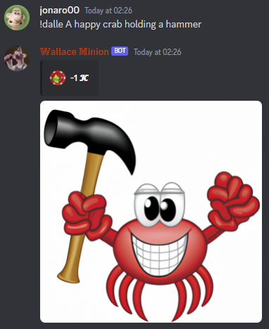
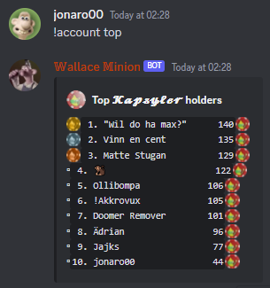
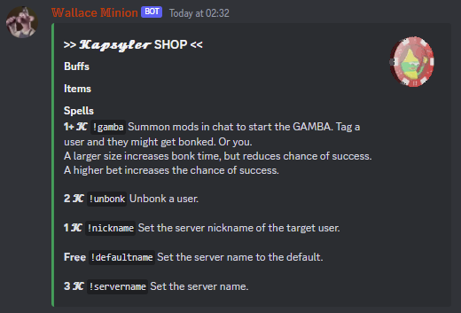
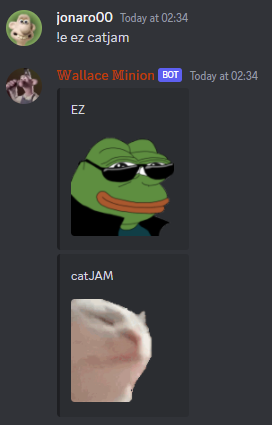
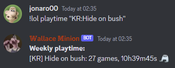

# Wallace Minion 🔨🙂 - a quite overloaded Discord bot

Wallace Minion is my first Rust project.
It started as a way to explore the Rust ecosystem and
to have something fun to play with in my private friend server.

It is still not adjusted to work in all servers, and since is uses
some paid APIs, I don't currently plan on making it public.
If there is enough interest, I might make a demo server where you can try it out.

## Technologies

- Made with [Rust](https://www.rust-lang.org/) 🦀
- Bot hosted on [Shuttle](https://www.shuttle.rs/) 🚀
- Postgres database in [Neon](https://neon.tech/) 🐘 managed with [Prisma](https://prisma.brendonovich.dev/) 🔼 queried with [sqlx](https://github.com/launchbadge/sqlx)
- Discord framework [Serenity](https://github.com/serenity-rs/serenity) 🏞 + [Songbird](https://github.com/serenity-rs/songbird) 🐦
- APIs: [OpenAI](https://platform.openai.com/docs/api-reference) 🤖, [7TV](https://7tv.app/) 🐸, [Riot](https://developer.riotgames.com/) 👊

## Features

*Use the `!help` command to see syntax and more details about every command.*

### ✨ AI chat with Text-to-Speech 🤖🔊

The `!ai` command lets you chat with Wallace Minion, via ChatGPT (currently `gpt-3.5-turbo`).
If you are in a voice channel, Wallace will join and read out the message for you using AWS Polly.

ChatGPT supports many languages.
TTS supports 21 languages (see `!languages`), and will detect which language is being read (default is English).
The detected language can be overridden to make some fun accents 😅.

https://user-images.githubusercontent.com/54029719/228099216-570ac72e-ee16-48ec-aab3-f35f320cecdd.mp4

*In the above video, the `!ai` and `!tts` command use language modifiers to narrate in a different language than the text. The `!say` command detects the language from the text.*

### ✨ Plain TTS in all supported languages 🌞

`!say` reads out any text in Voice.

`!tts` produces an ogg file as output instead.

### ✨ DALL-E image generation 🌆

`!dalle` generates an image from a prompt and uploads the output in Discord.

### ✨ Bank 🏦

Some Wallace features use Kapsyler as currency.

Open an account with `!account open`, check your balance with `!account`,
and see the biggest earners in the server with `!account top`.

Give Kapsyler to someone with `!give`.

### ✨ Casino 🎰

Totally win some Kapsyler with `!roll` and `!slots`.

https://user-images.githubusercontent.com/54029719/228099426-77179974-ea62-491f-982c-29eaa4202937.mp4

*A Roulette bet of 2 on black loses. Then a roll on the slots loses.*

### ✨ Shop and spells 🏪🧙‍♂️

Check available spells with `!shop`.

### ✨ 7TV Emotes 🐸 + 😎 = ?

Use `!e` to search for emotes on [7TV](https://7tv.app/emotes).
The first result is pasted in chat.

### ✨ Cool Text 🈷

𝖂𝖗𝖎𝖙𝖊 𝖘𝖔𝖒𝖊 𝖈𝖔𝖔𝖑 𝖚𝖓𝖎𝖈𝖔𝖉𝖊 𝖙𝖊𝖝𝖙 𝖜𝖎𝖙𝖍 𝖙𝖍𝖊 `!ct` 𝖈𝖔𝖒𝖒𝖆𝖓𝖉.

### ✨ Task Scheduling ⏰

Schedule a command to run in a channel with `!tasks`.
Trigger one or multiple times with a cron pattern.

### ✨ LoL and TFT 🖥

Get League of Legends and Teamfight Tactics playtime and analytics with `!lol` and `!tft`.

